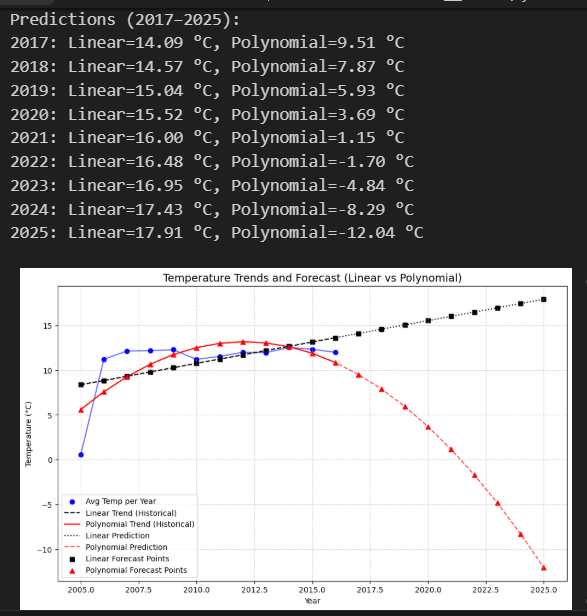

# Ex.No: 02

## LINEAR AND POLYNOMIAL TREND ESTIMATION

**Developed By :** VENKATANATHAN P R
**Register Number:** 212223240173

**Date:** 17-08-2025

---

### AIM:

To implement Linear and Polynomial Trend Estimation using Python.

---

### ALGORITHM:

1. Import necessary libraries (`pandas`, `numpy`, `matplotlib`, `sklearn`).
2. Load the dataset.
3. Convert the date column to datetime and extract the year.
4. Calculate the yearly average temperature.
5. Fit a **Linear Regression** model using least squares method.
6. Fit a **Polynomial Regression** model (degree 2).
7. Predict future temperature trends up to 2025.
8. Visualize the original data, linear trend, polynomial trend, and forecast.
9. End the program.

---

### PROGRAM:

```python
import pandas as pd
import numpy as np
import matplotlib.pyplot as plt
from sklearn.linear_model import LinearRegression
from sklearn.preprocessing import PolynomialFeatures

# Load dataset
df = pd.read_csv("weatherHistory.csv")

# Convert and extract year
df['Formatted Date'] = pd.to_datetime(df['Formatted Date'], utc=True, errors='coerce')
df['Year'] = df['Formatted Date'].dt.year

# Yearly average temperature
yearly_avg = df.groupby('Year')['Temperature (C)'].mean().reset_index()
X_vals = yearly_avg['Year'].values.reshape(-1, 1)
temps = yearly_avg['Temperature (C)'].values

# ---- Linear Regression ----
lin_model = LinearRegression()
lin_model.fit(X_vals, temps)
linear_fit = lin_model.predict(X_vals)

# ---- Polynomial Regression (Degree 2) ----
poly = PolynomialFeatures(degree=2, include_bias=False)
X_poly = poly.fit_transform(X_vals)
poly_model = LinearRegression()
poly_model.fit(X_poly, temps)
poly_fit = poly_model.predict(X_poly)

# ---- Future Prediction (up to 2025) ----
future_years = np.arange(X_vals.min(), 2026).reshape(-1, 1)  # Extend until 2025
future_linear = lin_model.predict(future_years)
future_poly = poly_model.predict(poly.transform(future_years))

# Display prediction values in console
print("Predictions (2017–2025):")
for year, l_val, p_val in zip(future_years.ravel(), future_linear, future_poly):
    if year >= 2017:  # Only show future years
        print(f"{year}: Linear={l_val:.2f} °C, Polynomial={p_val:.2f} °C")

# ---- Visualization ----
plt.figure(figsize=(12, 7))

# Original scatter and line
plt.scatter(X_vals, temps, color='blue', label="Avg Temp per Year")
plt.plot(X_vals, temps, color='blue', alpha=0.6)

# Trend lines
plt.plot(X_vals, linear_fit, 'k--', label="Linear Trend (Historical)")
plt.plot(X_vals, poly_fit, 'r-', label="Polynomial Trend (Historical)")

# Extended prediction lines
plt.plot(future_years, future_linear, 'k:', label="Linear Prediction")
plt.plot(future_years, future_poly, 'r--', alpha=0.7, label="Polynomial Prediction")

# Mark predicted points
plt.scatter(future_years, future_linear, marker='s', color='black', s=40, label="Linear Forecast Points")
plt.scatter(future_years, future_poly, marker='^', color='red', s=40, label="Polynomial Forecast Points")

plt.title("Temperature Trends and Forecast (Linear vs Polynomial)", fontsize=14)
plt.xlabel("Year")
plt.ylabel("Temperature (°C)")
plt.legend()
plt.grid(True, linestyle="--", alpha=0.6)
plt.show()
```

---

### OUTPUT:

**A - Linear Trend Estimation**

Displayed in the graph as the black dashed line (historical) and black dotted line (prediction) with square forecast points.

**B - Polynomial Trend Estimation**

Displayed in the graph as the red solid line (historical) and red dashed line (prediction) with triangular forecast points.



---

### RESULT:

Thus, the Python program for Linear and Polynomial Trend Estimation has been executed successfully.

